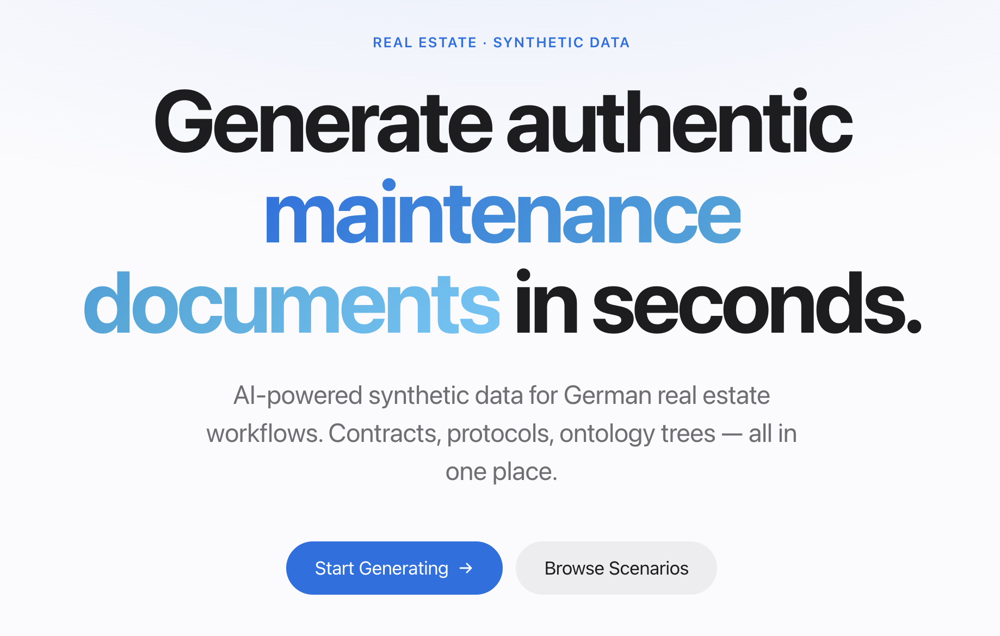
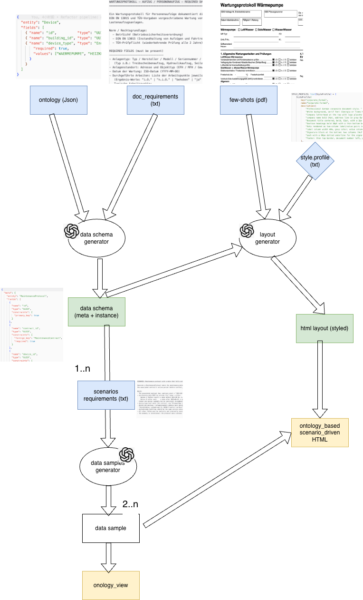
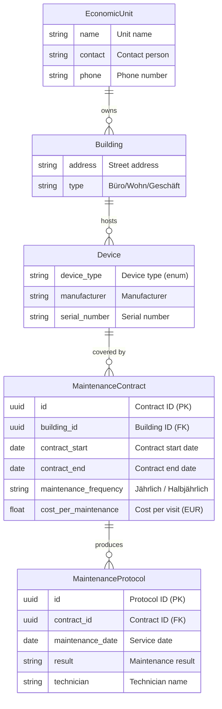

# Synthetic Data Generation — 1000plus

Generates synthetic German maintenance documents (Wartungsverträge, Wartungsprotokolle) using Claude via AWS Bedrock. The pipeline produces structured JSON, HTML layouts, and filled documents across multiple visual style variants. A scenario layer injects deliberate domain anomalies (missing protocols, overlapping contracts, date/address mismatches, frequency violations) to support data-quality testing.

---

## Web UI

A browser-based interface lets non-CLI users run the full pipeline and explore results without touching the command line.



**Features:**
- **Generate** — 3-step wizard (document type → visual style → one-click generate). Streams live progress via SSE and displays all output PDFs with download links plus a collapsible ontology tree on completion.
- **Scenarios** — browse all generated scenario folders. Clicking a scenario loads its ontology tree (EconomicUnit → Building → Device → Contract → Protocol) with search and expand/collapse.
- **Functions** — run any individual pipeline step (schema generation, data filling, ontology assembly, HTML layout, placeholder fill, PDF conversion) with file upload inputs and JSON output preview.
- **Dashboard** — overview of supported system types, document types, scenarios, and style variants.

**Stack:** React + TypeScript + Vite frontend · FastAPI + uvicorn backend · SSE for streaming pipeline progress.

```bash
# Start backend (port 8000)
venv/bin/python backend/main.py

# Start frontend (port 5173)
cd frontend && npm install && npm run dev
```

Open `http://localhost:5173`.

---

## Pipeline Overview



## Data Model



---

## Pipeline (Step-by-Step)

### Step 1 — Generate a placeholder template

Reads `document_requirements/<doc_key>/<system_key>.txt` and `entities_meta/<doc_key>.json`, returns a JSON with `meta`, `required`, and `optional` sections where every value is a `<Placeholder>`.

```bash
cd main
python data_schema_generator.py <doc_key> <system_key>
# output → output/templates/<doc_key>_<system_key>_template.json
```

Examples:
```bash
python data_schema_generator.py wartungsvertrag KLIMAANLAGE
python data_schema_generator.py wartungsprotokoll WAERMEPUMPE
```

### Step 2 — Fill template(s) with real data

Reads one or more template JSON files and a scenario spec, fills all placeholders in a **single LLM call** (so values are consistent across documents).

```bash
# single document
python data_samples_generator.py <template.json> <scenario_spec.txt>

# multiple documents (consistent values across all)
python data_samples_generator.py \
  --template output/templates/wartungsvertrag_KLIMAANLAGE_template.json \
  --template output/templates/wartungsprotokoll_KLIMAANLAGE_template.json \
  --scenario scenario_specifications/normal.txt \
  --out-dir output/data/my_run/
```

Output: one `<EntityName>.json` per template in `output/data/<scenario>/`.

### Step 3 — Generate HTML layout

Reads a template JSON (placeholder values preserved) and few-shot PDFs, generates HTML via the LLM.

```bash
python html_generator.py <template.json> <doc_key> [<style_key>|all] [--no-few-shots]
# output → output/html/<template_stem>_<style_key>.html
```

Style keys: `corporate_formal`, `field_service_form`, `municipal_office`, `modern_saas`, `handwritten_scan`

```bash
python html_generator.py output/templates/wartungsvertrag_KLIMAANLAGE_template.json wartungsvertrag corporate_formal
python html_generator.py output/templates/wartungsvertrag_KLIMAANLAGE_template.json wartungsvertrag all --no-few-shots
```

### Step 4 — Fill HTML with real data

Replaces `<Label>` placeholders in an HTML file with real values from a filled data JSON.

```bash
python fill_html.py <data.json> <template.html> [<out.html>]
# output → output/filled/<html_stem>_filled.html
```

### Ontology View

Assembles multiple data JSON files into a single hierarchical ontology tree:
`EconomicUnit → Building → Device → Contract → Protocols`

```bash
python ontology_view.py <data1.json> [<data2.json> ...] --out <out.json>
# default output → output/ontology/ontology_view.json
```

---

## Project Structure

<details>
<summary>Expand</summary>

```
SyntheticDataGeneration/
├── main/
│   ├── data_schema_generator.py       # Step 1 — generate placeholder template JSON from requirements
│   ├── data_samples_generator.py      # Step 2 — fill template(s) with real data via scenario spec
│   ├── html_generator.py              # Step 3 — generate HTML layout from template JSON
│   ├── fill_html.py                   # Step 4 — replace <label> placeholders with real values
│   ├── ontology_view.py               # Assemble ontology tree from multiple data JSON files
│   ├── pdf_converter.py               # HTML → PDF via Playwright
│   ├── style_profiles.py              # 5 visual style variants
│   ├── pipeline.py                    # Legacy end-to-end pipeline (kept for reference)
│   │
│   ├── document_requirements/         # Per-system requirement specs (.txt)
│   │   ├── wartungsvertrag/           #   e.g. KLIMAANLAGE.txt, WAERMEPUMPE.txt …
│   │   └── wartungsprotokoll/
│   ├── entities_meta/                 # Entity schema JSON files (ontology field definitions)
│   │   ├── wartungsvertrag.json       #   → MaintenanceContract fields
│   │   ├── wartungsprotokoll.json     #   → MaintenanceProtocol fields
│   │   ├── Building.json
│   │   ├── Device.json
│   │   ├── EconomicUnit.json
│   │   └── ServiceProvider.json
│   ├── scenario_specifications/       # Scenario prompt files (one .txt per anomaly)
│   │   ├── normal.txt
│   │   ├── no_protocols.txt
│   │   ├── multi_contract.txt
│   │   ├── protocol_outside_contract.txt
│   │   ├── frequency_mismatch.txt
│   │   └── address_mismatch.txt
│   ├── few_shots/                     # Example PDFs for few-shot HTML prompting
│   │
│   └── output/                        # All generated artefacts (gitignored)
│       ├── templates/                 #   placeholder template JSON files
│       ├── data/                      #   filled data JSON files
│       ├── html/                      #   HTML layouts
│       ├── filled/                    #   filled HTMLs
│       └── ontology/                  #   ontology view JSON files
│
├── backend/
│   └── main.py                        # FastAPI backend — SSE pipeline + all function endpoints
├── frontend/                          # React + TypeScript + Vite UI
│   └── src/
│       ├── pages/                     #   Generate, Scenarios, Functions, Dashboard, Preview
│       └── components/                #   Navbar
├── ontology_schema_future/            # OWL ontology + SHACL shapes (reference, not wired to pipeline)
├── version_bk/                        # Evaluation / prototyping scratch
├── requirements.txt
└── README.md
```

</details>

---

## Prerequisites

- Python >= 3.10
- AWS CLI configured with Bedrock access in `eu-central-1`
- Playwright Chromium: `playwright install chromium`
- Node.js >= 18 (for the frontend)

## Setup

```bash
python -m venv venv
source venv/bin/activate          # Windows: .\venv\Scripts\activate
pip install -r requirements.txt
playwright install chromium
```

AWS credentials:
```bash
aws configure --profile claude-bedrock
aws sts get-caller-identity --profile claude-bedrock
```

On non-Windows the pipeline uses the default boto3 credential chain. On Windows it looks for a `claude-bedrock` named profile.

See the [Web UI](#web-ui) section above for starting the frontend and backend.

---

## Scenario Specifications

Each `.txt` in `scenario_specifications/` describes one anomaly scenario passed as instructions to the LLM during data generation.

| File | Anomaly |
|---|---|
| `normal.txt` | Fully coherent data, no anomalies |
| `no_protocols.txt` | Active contract with zero protocol records |
| `multi_contract.txt` | Two overlapping contracts for the same device in one building |
| `protocol_outside_contract.txt` | Protocol date falls before contract_start or after contract_end |
| `frequency_mismatch.txt` | Two protocols in one quarter, or a quarter with no protocol |
| `address_mismatch.txt` | Protocol location address differs from the contract building address |

Add a new scenario by creating `scenario_specifications/<name>.txt` with plain-English instructions.

---

## Supported Document Types

| doc_key | Description |
|---|---|
| `wartungsvertrag` | Maintenance contract |
| `wartungsprotokoll` | Maintenance protocol / service record |

## Supported System Types (`system_key`)

`KLIMAANLAGE`, `WAERMEPUMPE`, `HEIZKESSEL`, `LUEFTUNGSANLAGE`, `BRANDMELDEANLAGE`, `SPRINKLER`, `RAUCHMELDER`, `FEUERSCHUTZTUER`, `RAUCHSCHUTZ_RWA`, `SICHERHEITSBELEUCHTUNG`, `AUFZUG_PERSONEN`, `ELEKTRISCHE_ANLAGE`, `HEBEANLAGE_ABWASSER`, `NOTSTROMAGGREGAT`, `FEUERSCHUTZABSCHLUSS`, `FEUERSCHUTZEINRICHTUNG_MANUELL`, `SANITAER_ALLG`, `ELEKTRISCHE_ANLAGE_MOBIL`, `BLITZSCHUTZ`, `DRUCKBEHAELTER`, `CO_WARNANLAGE`

---

## Tech Stack

| Component | Technology | Purpose |
|---|---|---|
| LLM Inference | Claude Sonnet 4.6 via AWS Bedrock | Template generation / data filling / HTML layout |
| Parallelism | `concurrent.futures.ThreadPoolExecutor` | 5 style HTML variants generated concurrently |
| PDF Rendering | Playwright Headless Chromium | HTML → A4 PDF conversion |
| Multimodal Input | Claude Vision + base64 PDF blocks | Few-shot layout learning from real documents |
| Data Serialization | JSON + Python data classes | Templates / data / ontology interchange |
| AWS Integration | boto3 | Bedrock API calls |
| Backend API | FastAPI + uvicorn | SSE streaming pipeline + REST endpoints |
| Frontend | React + TypeScript + Vite | Browser UI for non-CLI users |
