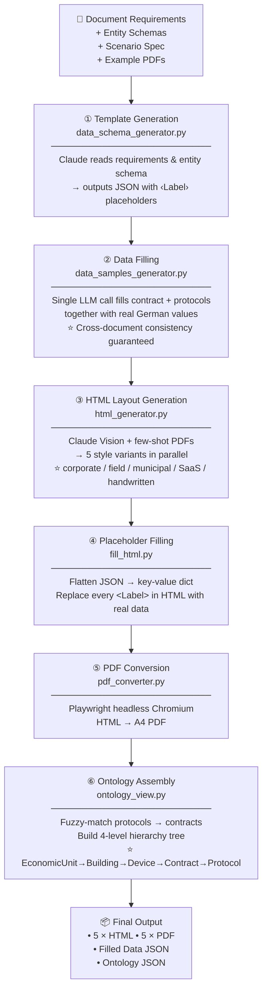
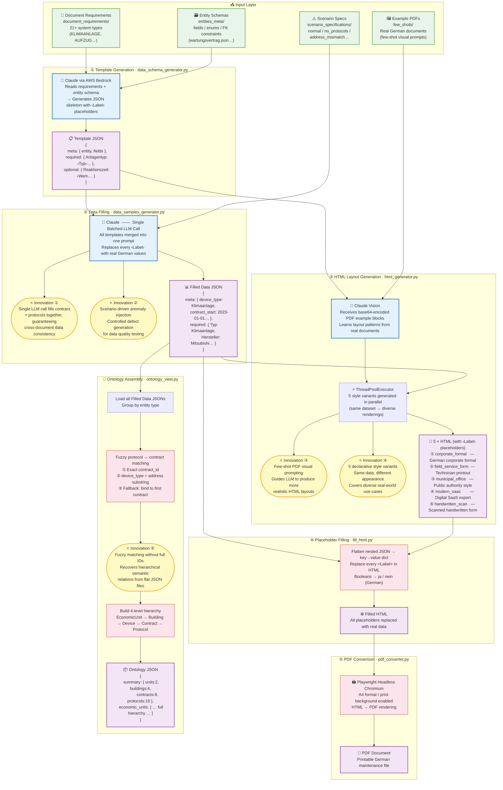
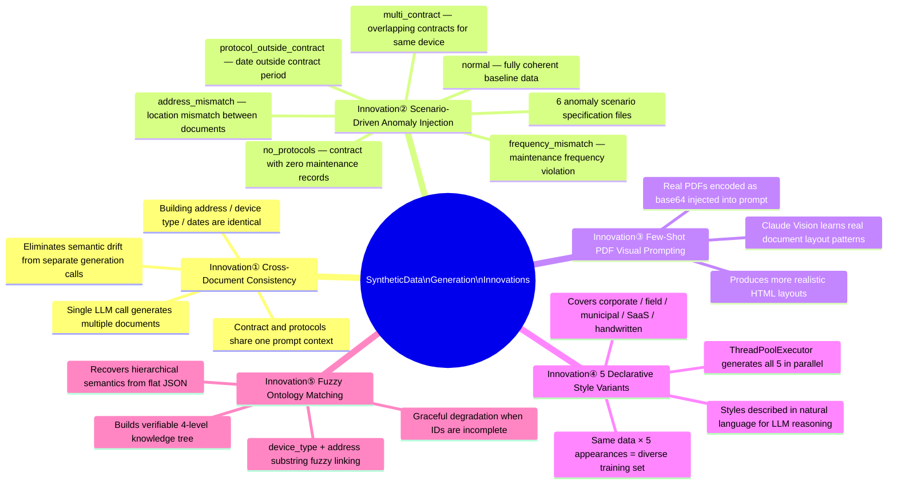
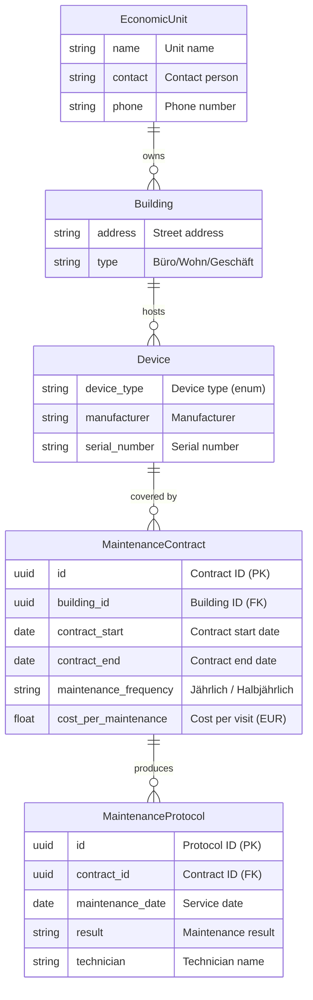

# SyntheticDataGeneration — System Flowchart

## Pipeline

---

## Overall Architecture & Innovations

---

## Five Key Innovations

---

## Data Model

---

## Technology Stack

| Component | Technology | Purpose |
|---|---|---|
| LLM Inference | Claude Sonnet 4.6 via AWS Bedrock | Template generation / data filling / HTML layout |
| Parallelism | `concurrent.futures.ThreadPoolExecutor` | 5 style HTML variants generated concurrently |
| PDF Rendering | Playwright Headless Chromium | HTML → A4 PDF conversion |
| Multimodal Input | Claude Vision + base64 PDF blocks | Few-shot layout learning from real documents |
| Data Serialization | JSON + Python data classes | Templates / data / ontology interchange |
| AWS Integration | boto3 | Bedrock API calls |
